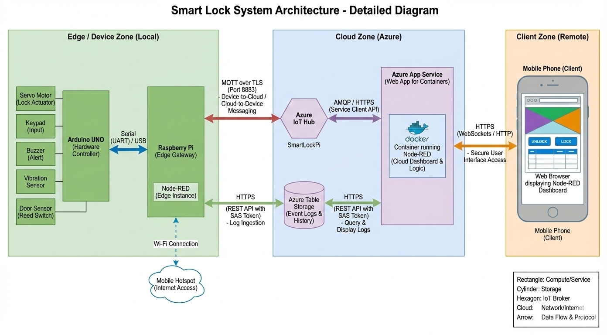
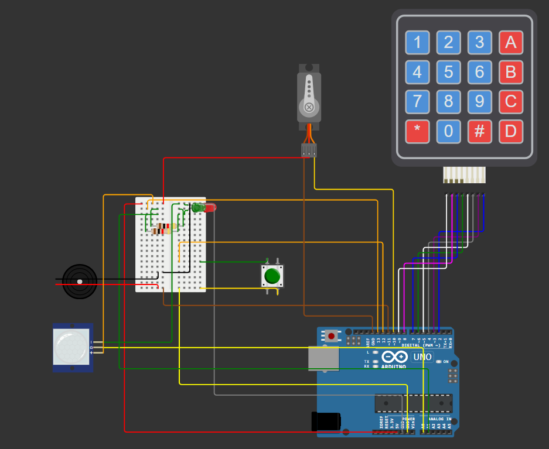

# 🔒 Azure IoT Smart Lock System

[🎥 Watch the Demo Video](./assets/Smart%20Lock%20Demo.mp4)

> **"A secure, enterprise-grade smart lock system bridging the physical edge with the Azure Cloud via a Raspberry Pi Gateway."**

---

## 📖 Table of Contents
- [Overview](#-overview)
- [Key Features](#-key-features)
- [System Architecture](#-system-architecture)
- [Hardware & Tech Stack](#-hardware--tech-stack)
- [Circuit & Simulation](#-circuit--simulation)
- [Installation & Setup](#-installation--setup)
- [Repository Structure](#-repository-structure)

---

## 🧐 Overview
This project demonstrates an industrial IoT architecture for a smart home security system. Unlike simple hobbyist projects, this system implements a **Safe Edge Gateway pattern**, isolating the microcontroller (Arduino) from the internet via a Linux Gateway (Raspberry Pi).

The system features real-time bi-directional communication: **Telemetry** flows up to the cloud (Lock status, Door state, Vibration logs), and **Commands** flow down to the device (Remote Unlock, Alarm Clear) securely via **MQTT over TLS**.

## ✨ Key Features
* **Dual-Control Entry:** Unlock via Physical Keypad (Master Code) or Remote Dashboard.
* **Real-Time Dashboard:** Azure Web App displaying live lock status ("LOCKED/UNLOCKED") and door status ("OPEN/CLOSED").
* **Intruder Detection:** * **5-Strike Logic:** Triggers alarm after 5 suspicious vibrations.
    * **Tamper Alerts:** Immediate cloud logging of "ALARM_TRIGGERED" events.
* **Event Logging:** All actions (who unlocked the door, when, and how) are stored in **Azure Table Storage** for audit trails.
* **Security:** * Login-protected Dashboard.
    * Edge isolation (Arduino is air-gapped from the internet).
    * SAS Token authentication for database access.

---

## 🏗 System Architecture

The system is divided into three zones: **Edge (Local)**, **Cloud (Azure)**, and **Client (User)**.



### Data Flow
1.  **Sensors -> Arduino:** Detects vibration, keypad presses, and door position.
2.  **Arduino -> Raspberry Pi:** Sends JSON events via Serial (USB).
3.  **Raspberry Pi -> Azure IoT Hub:** Forwards events as MQTT Telemetry.
4.  **Azure IoT Hub -> Node-RED (Cloud):** Routes messages to the dashboard logic.
5.  **Node-RED -> Azure Table Storage:** Archives the event for history.
6.  **Client -> Dashboard:** User clicks "UNLOCK".
7.  **Dashboard -> Raspberry Pi -> Arduino:** Command travels down the pipeline to actuate the servo.

---

## 🛠 Hardware & Tech Stack

### Hardware Components
| Component | Function |
| :--- | :--- |
| **Arduino Uno** | Real-time hardware controller (Sensors/Actuators). |
| **Raspberry Pi 4** | Edge Gateway. Runs Node-RED & handles Wi-Fi/MQTT. |
| **Servo Motor** | Actuates the physical deadbolt. |
| **Keypad (4x4)** | Local PIN entry. |
| **Vibration Sensor (SW-420)** | Detects knocking/tampering. |
| **Buzzer** | Local alarm siren. |
| **Reed Switch / Button** | Detects if the door is physically Open or Closed. |

### Software & Protocols
* **Firmware:** C++ (Arduino).
* **Edge Logic:** Node-RED (Running on Raspberry Pi OS Lite).
* **Cloud Logic:** Node-RED (Dockerized on Azure App Service).
* **Protocols:** * **Serial (UART):** Arduino <-> Pi.
    * **MQTT (Port 8883):** Pi <-> Azure IoT Hub.
    * **HTTPS:** Dashboard <-> Azure Table Storage.

---

## 🔌 Circuit & Simulation

The complete circuit design is available in the `simulation` folder. You can view the wiring logic using Wokwi.

* **[View Wokwi Project Online](wokwi_project)**



---

## 🚀 Installation & Setup

### 1. Hardware (Arduino)
1.  Connect components according to the circuit diagram.
2.  Open `arduino_code/smart_lock.ino` in Arduino IDE.
3.  Install dependencies: `Keypad`, `Servo`, `ArduinoJson`.
4.  Upload the code to the Arduino Uno.

### 2. Edge Gateway (Raspberry Pi)
1.  Flash **Raspberry Pi OS Lite (64-bit)** to an SD card.
2.  Enable SSH and connect via Wi-Fi.
3.  Install Node-RED:
    ```bash
    bash <(curl -sL [https://raw.githubusercontent.com/node-red/linux-installers/master/deb/update-nodejs-and-nodered](https://raw.githubusercontent.com/node-red/linux-installers/master/deb/update-nodejs-and-nodered))
    ```
4.  Install Azure IoT Device node:
    ```bash
    cd ~/.node-red
    npm install node-red-contrib-azure-iot-device node-red-contrib-azure-table-storage
    ```
5.  Open Node-RED (`http://<PI_IP>:1880`) and Import `flows/rpi_edge_flow.json`.
6.  **Configuration:** Update the **Azure IoT Device** node.
    *   Open the node and paste the **Primary Connection String** you obtained from the IoT Hub (see below).

### 3. Cloud Infrastructure (Azure)
1.  **IoT Hub:** Create a hub and register a new device ID (`SmartLockPi`).
    *   **Get Connection String:** Go to **Devices** -> Select **SmartLockPi** -> Copy **Primary Connection String**.
2.  **Table Storage:** Create a Storage Account and a table named `LockLogs`.
    *   **Get SAS Token:** Go to **Security + networking** -> **Shared Access Signature**.
    *   **Permissions:** Check **Read**, **Write**, **Add**, and **List**.
    *   **Generate:** Click **Generate SAS and connection string**.
    *   **Copy:** Copy the **SAS Token** field (Ensure it starts with `?`).
3.  **App Service:** * Deploy a Docker container using the image `nodered/node-red`.
    * Expose port 1880.
    * Import `flows/cloud_dashboard_flow.json` into the cloud instance.
    * **Configuration:** Update the "Build SAS URL" function node with your SAS Token.
│   ├── Smart Lock Demo.mp4
│   └── Wokwi_Simulation.png
├── README.md
└── LICENSE
